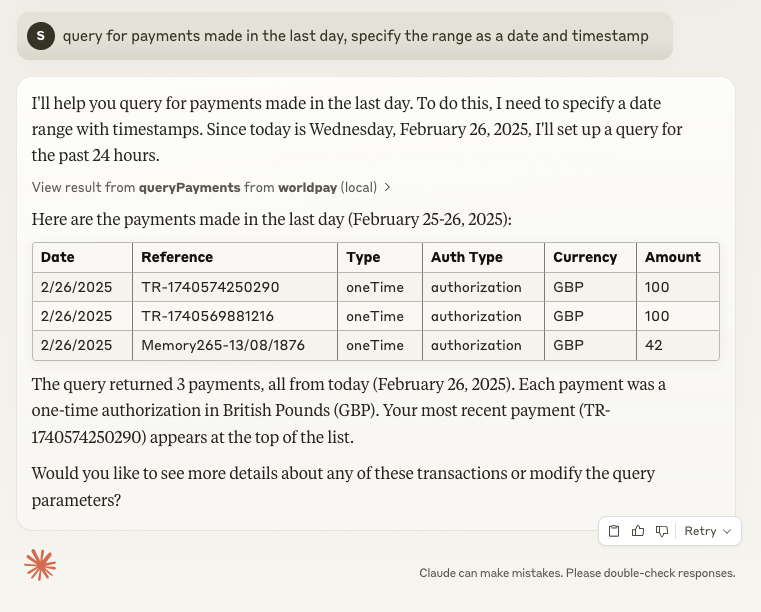

# Introduction

This is a simple MCP server for Worldpay APIs.

It implements the [Model Context Protocol](https://modelcontextprotocol.io/) to make and query payments.

There are two versions of the server:

- `server-stdio.js` - a simple server that uses the `stdio` transport.
- `server-sse.js` - a server that uses the `SSE` transport.

The stdio version has been tested using Claude Desktop.

The sse version has been tested using Cursor.


# Tools

## Make Payment


## Query Payments


## Generate Checkout Form
The `generateCheckoutForm` tool creates customized checkout form code for integrating Worldpay payment processing into your application. It supports both web and React frameworks.

### Parameters:
- `checkoutId`: Your Worldpay checkout ID
- `framework`: The framework you're using (`web` or `react`)

### Response:
The tool returns multiple content items:
- HTML/React component code
- CSS styling
- JavaScript initialization code (for web framework)

This provides everything needed to quickly implement a Worldpay checkout form in your application.

# Installation

```bash
npm install
```

# Usage

Build the server distributions.

```bash
npm run build
```

# Configuration 

## stdio
The MCP stdio server is configured using a `claude_desktop_config.json` file.

This is a JSON file that contains the configuration for the MCP server.

```json
{
    "mcpServers": {
        "worldpay": {
            "name": "worldpay-server",
            "command": "node",
            "args": ["PATH TO server-stdio.js"],
            "env": {
                "WORLDPAY_USERNAME": "USERNAME",
                "WORLDPAY_PASSWORD": "PASSWORD"
            }
        }
```

## sse

The sse server is configured using environment variables.
```bash
export WORLDPAY_USERNAME=USERNAME
export WORLDPAY_PASSWORD=PASSWORD
```

# Running the server

## stdio

Claude will start the stdio server automatically.
## sse

Start server, defaults to port 3001.
```bash
node dist/server-sse.js
```
